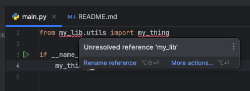

# PyCharm Editable Package Repro

A minimal reproduction for: https://youtrack.jetbrains.com/issue/PY-60894/package-installed-in-editable-mode-not-recognized-by-PyCharm

## Requirements

Python 3.9.18, Poetry 1.7.1

## Setup

This repository holds two subprojects, `my_lib` and `my_runtime`.

`my_runtime` depends on `my_lib` and the dependency is installed in editable mode using [Poetry](my_runtime/pyproject.toml)

The way I set it up in Pycharm is the following:

1. Open `<repo_root>`
2. Open `<repo_root>/my_lib` -> "Attach"
3. Open `<repo_root>/my_runtime` -> "Attach"
4. Set `<repo_root>` interpreter to System Python interpreter
5. Set `my_lib` interpreter to new poetry venv
6. Set `my_runtime` interpreter to new poetry venv

## Running

Running `cd my_runtime && poetry run python -m my_runtime.main`, we can see that the editable package can indeed be imported without a problem.

## The Issue

Open [my_runtime/my_runtime/main.py](./my_runtime/my_runtime/main.py).
As you can see, PyCharm is unable to find the `my_lib` package.

As you can see below, the interpreter for `my_runtime` **does** have the `my_lib` package installed:

## Why this is a problem

We have a repository with around 10 sub-projects like this, that all depend on two common editable packages installed in this way (one runtime, one dev tools)

In VS Code, using multi-root workspaces, this behavior works as expected using either Jedi or Pylance.. I was surprised to find PyCharm didn't work.

I've included the vscode workspace file, too: [pycharm-editable-packages.code-workspace](pycharm-editable-packages.code-workspace)
Simply open it with `code pycharm-editable-packages.code-workspace` and select the interpreter for both workspaces (`my-lib` and `my-runtime`)
by using `cmd+shift+p` > `Python: Select Interpreter`
